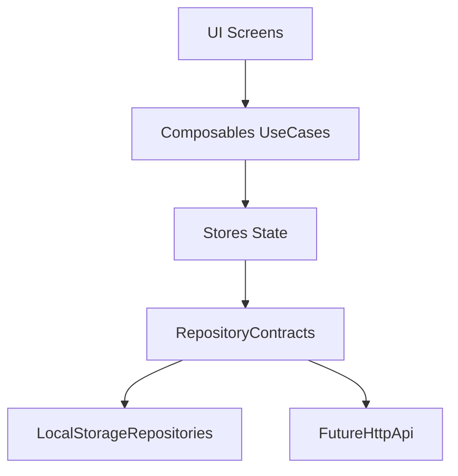

# TimeFlow Prototype

Mobile-first прототип фронтенд-приложения для управления временем на `Vite ^8.0.0-beta.13+`, `Vue 3`, `TypeScript`, `Vue Router`, `PrimeVue` и иконках `@phosphor-icons/vue`.

## Запуск

```bash
bun install
bun run dev
```

## Сценарии

- `bun run dev` — запуск dev-сервера
- `bun run build` — typecheck + production build
- `bun run preview` — локальный предпросмотр production-сборки

## Структура проекта

```text
app
├── api
│   ├── contracts.ts
│   └── repositories
├── assets/css
├── components
│   ├── elements
│   ├── screens
│   └── ui
├── composables
├── constants
├── layouts
├── router
├── stores
├── types
└── utils
```

## Архитектурное решение

Использован слойный подход `UI -> Composable (use-case) -> Store -> Repository`:

- **UI (`components/*`)**: только отображение и пользовательские события.
- **Use-cases (`composables/*`)**: бизнес-правила экранов (сортировка, фильтрация, drag'n'drop, комментарии).
- **State (`stores/*`)**: централизованное состояние экранов и единая точка сохранения.
- **Data (`api/*`)**: контракты и реализации репозиториев.

Преимущества:

- слабая связность между интерфейсом и хранилищем данных;
- простая замена `localStorage` на HTTP API через те же контракты;
- минимальный размер компонентов и предсказуемый поток данных.

### Поток данных



## Хранение данных

- Источник данных: `localStorage`.
- Абстракция: `app/api/contracts.ts` + `app/api/repositories/*`.
- Ключи и seed-данные: `app/constants/storage.ts`.

## Доменные сущности

- `PlannedAction` — действие: описание, время (или `null`), признак незапланированной задачи, порядок.
- `EventItem` — событие в ленте: описание, время, комментарии.
- `EventComment` — комментарий к событию.

Типы описаны в `app/types/domain.ts`.

## Страницы

- `Запланированные действия` — задачи с датой/временем, фильтрация, сортировка и CRUD через диалог.
- `Незапланированные действия` — бэклог без даты, drag'n'drop в ручном порядке и CRUD через диалог.
- `Лента событий` — хронология, комментарии и CRUD карточек событий.

## Правила перехода между action-лентами

- Если у действия указана `Дата и время`, оно отображается в «Запланированные».
- Если дату очистить в диалоге, действие автоматически попадает в «Незапланированные».
- Если в незапланированном действии задать дату, оно автоматически переходит в «Запланированные».

## Статусы действий

- `Активно` — задача в работе.
- `Завершено` — задача выполнена.
- `Отменено` — задача отменена.
- Статус можно менять прямо из карточки действия.

## UX-рекомендации для дальнейшего развития

- Добавить явные состояния загрузки/ошибки при будущей API-интеграции.
- Подсветить текущую позицию drop-зоны при перетаскивании.
- Добавить undo для удаления/перемещения задач.
- Сохранять последний выбранный фильтр/сортировку между сессиями.
- Расширить доступность: `aria-live` для системных уведомлений и более явные focus-ring состояния.
